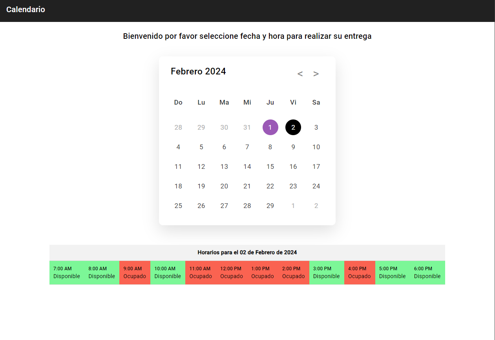

# Calendar

This project was generated with [Angular CLI](https://github.com/angular/angular-cli) version 15.2.10.

La aplicación es un proyecto simple que te permite elegir un día en un calendario para solicitar la entrega de paquetería. Después de seleccionar un día, te muestra los horarios disponibles en una tabla debajo del calendario para que puedas elegir. Los horarios ocupados están resaltados en rojo, mientras que los horarios disponibles están resaltados en verde. Es una forma fácil de programar la entrega de tus paquetes.

La aplicación utiliza una base de datos conectada a Angular mediante Firebase 9.

## Modo Desarrollo

Ejecuta `ng serve` para iniciar un servidor de desarrollo. Ve a `http://localhost:4200/`. En tu navegador. La aplicación se recargará automáticamente si realizas cambios en alguno de los archivos fuente.
